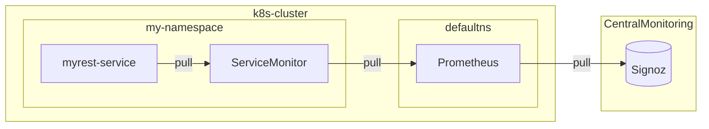

# Metrics

This document describes how kubernetes apps can send their OpenMetric compatible metrics to central prometheus server in kubernetes.

- [Metrics](#metrics)
  - [Introduction](#introduction)
  - [Goal](#goal)
  - [About the REST Service](#about-the-rest-service)
  - [Demo](#demo)
    - [Deploy Sample Rest Service](#deploy-sample-rest-service)
    - [Verify that metrics are available on prometheus](#verify-that-metrics-are-available-on-prometheus)
  - [Conclusion](#conclusion)
  - [Cleanup](#cleanup)
  - [Appendix](#appendix)
    - [Initial Setup](#initial-setup)
      - [Deploy Prometheus Kubernetes Operator](#deploy-prometheus-kubernetes-operator)
      - [Deploy an Instance of Prometheus](#deploy-an-instance-of-prometheus)


## Introduction

This section provides overview of how kubernetes based monitoring works with prometheus.




1. The prometheus based monitoring in kubernetes is done by using [prometheus kubernetes operator](https://github.com/prometheus-operator/prometheus-operator/blob/main/Documentation/user-guides/getting-started.md).
2. The prometheus kubernetes operator introduces few custom resources
   1. **Prometheus:** This is used to define prometheus server which will poll metrics from various sources. Look for `kind: Prometheus` in [prometheus.yaml](../demos/tut-rest/nonrest/kube/prometheus.yaml).
   2. **ServiceMonitor:** This is used to specify which service needs to be monitored by prometheus. The service is specified using labels. Look for `kind: ServiceMonitor` in [deployment.yaml](../demos/tut-rest/nonrest/kube/deployment.yaml).
   3. **PodMonitor** Just like ServiceMonitor, this is used to monitor pods.
3. In order to connect pods and services to prometheus, we create ServiceMonitor and PodMonitor resources.


## Goal

1. In this demo, we will deploy a sprint boot based REST service which exposes OpenMetrics compatible metrics on `/actuator/prometheus` url on its main port.
2. We will deploy a service-monitor to connect this service to prometheus.
3. Then we will verify that we are able to see the metric on prometheus.

## About the REST Service

1. This is a simple spring-boot rest service and code can be found it [nonrest](../demos/tut-rest/nonrest/) folder.
2. It uses spring-boot's [actuator](https://docs.spring.io/spring-boot/docs/current/reference/html/actuator.html) feature to publish metrics.
3. The logic to publish metrics is in [EmployeeController.java](../demos/tut-rest/nonrest/src/main/java/payroll/EmployeeController.java).
4. Look for statements like following that update the metrics.
     ```java
     readCounter.increment(emps.size());
     createdCounter.increment();
     readCounter.increment();
     updatedCounter.increment();
     deletedCounter.increment();
     ```
5. In case you are not using spring-boot, your application can use [prometheus client libraries](https://prometheus.io/docs/instrumenting/clientlibs/) to publish metrics.


## Demo

### Create an AKS cluster
1. Follow the document to create AKS cluster https://learn.microsoft.com/en-us/azure/aks/learn/quick-kubernetes-deploy-cli

### Deploy Sample Rest Service

1. Create a namespace with label `monitored-by: prometheus`. The prometheus instance is deployed in such a way that it will search for ServiceMonitor objects in only those namespaces which have this label.

```bash
# Create namespace
$ k create ns demons
# Output
namespace/demons created

# Add label so that prometheus can find it.
$ k label namespaces demons monitored-by=prometheus --overwrite=true
# Output
namespace/demons labeled

# Set this namespace as default.
$ k config set-context --current --namespace demons
# Output
Context "arn:aws:eks:ap-south-1:202142075460:cluster/despicableme" modified
```

2. Deploy our sample rest service in this namespace.

```bash
# Go to the demo folder in nimble-docs repo
cd ~/repos/nimble-docs/demos/tut-rest/nonrest/kube/
# Deploy sample service
$ k apply -f deployment.yaml 
# Output
deployment.apps/myrest-deployment created
service/myrest-service created
servicemonitor.monitoring.coreos.com/myrest created
podmonitor.monitoring.coreos.com/myrest created
```

3. Lets test the service to make sure it is working.

```bash
# Port forward to use the service
$ k port-forward svc/myrest-service 8080:80
# Output
Forwarding from 127.0.0.1:8080 -> 8080


# In another terminal, test the service
# Get employees
$ curl localhost:8080/employees
# Output
[{"id":1,"name":"Bilbo Baggins","role":"burglar"}
,{"id":2,"name":"Frodo Baggins","role":"thief"}]

# Lookup a non existent employee
$ curl localhost:8080/employees/99
# Output
Could not find employee 99

# Create a new employee
$ curl -X POST localhost:8080/employees -H 'Content-type:application/json' -d '{"name": "Samwise Gamgee", "role": "gardener"}'
# Output
{"id":3,"name":"Samwise Gamgee","role":"gardener"}

# Update new employee's role
$ curl -X PUT localhost:8080/employees/3 -H 'Content-type:application/json' -d '{"name": "Samwise Gamgee", "role": "ring bearer"}'
# Output
{"id":3,"name":"Samwise Gamgee","role":"ring bearer"}

# Get employees
$ curl localhost:8080/employees
# Output
[{"id":1,"name":"Bilbo Baggins","role":"burglar"}
,{"id":2,"name":"Frodo Baggins","role":"thief"}
,{"id":3,"name":"Samwise Gamgee","role":"ring bearer"}]

# Delete employee
$ curl -X DELETE localhost:8080/employees/3

# Make sure prometheus metrics are also available
$ curl localhost:8080/actuator/prometheus | grep employees
# Output
  % Total    % Received % Xferd  Average Speed   Time    Time     Time  Current
                                 Dload  Upload   Total   Spent    Left  Speed
100 14613  100 14613    0     0   108k      0 --:--:-- --:--:# HELP employees_deleted_total  
--# TYPE employees_deleted_total counter
 employees_deleted_total 1.0
--:-# HELP employees_created_total  
-:# TYPE employees_created_total counter
-employees_created_total 1.0
-  http_server_requests_seconds_count{exception="None",method="POST",outcome="SUCCESS",status="200",uri="/employees",} 1.0
108http_server_requests_seconds_sum{exception="None",method="POST",outcome="SUCCESS",status="200",uri="/employees",} 0.03781932
k
http_server_requests_seconds_count{exception="None",method="GET",outcome="SUCCESS",status="200",uri="/employees",} 2.0
http_server_requests_seconds_sum{exception="None",method="GET",outcome="SUCCESS",status="200",uri="/employees",} 0.18980657
http_server_requests_seconds_count{exception="EmployeeNotFoundException",method="GET",outcome="CLIENT_ERROR",status="404",uri="/employees/{id}",} 1.0
http_server_requests_seconds_sum{exception="EmployeeNotFoundException",method="GET",outcome="CLIENT_ERROR",status="404",uri="/employees/{id}",} 0.016791891
http_server_requests_seconds_count{exception="None",method="PUT",outcome="SUCCESS",status="200",uri="/employees/{id}",} 1.0
http_server_requests_seconds_sum{exception="None",method="PUT",outcome="SUCCESS",status="200",uri="/employees/{id}",} 0.011833133
http_server_requests_seconds_count{exception="None",method="DELETE",outcome="SUCCESS",status="200",uri="/employees/{id}",} 1.0
http_server_requests_seconds_sum{exception="None",method="DELETE",outcome="SUCCESS",status="200",uri="/employees/{id}",} 0.012306675
http_server_requests_seconds_max{exception="None",method="POST",outcome="SUCCESS",status="200",uri="/employees",} 0.0
http_server_requests_seconds_max{exception="None",method="GET",outcome="SUCCESS",status="200",uri="/employees",} 0.0
http_server_requests_seconds_max{exception="EmployeeNotFoundException",method="GET",outcome="CLIENT_ERROR",status="404",uri="/employees/{id}",} 0.0
http_server_requests_seconds_max{exception="None",method="PUT",outcome="SUCCESS",status="200",uri="/employees/{id}",} 0.0
http_server_requests_seconds_max{exception="None",method="DELETE",outcome="SUCCESS",status="200",uri="/employees/{id}",} 0.0
# HELP employees_read_total  
# TYPE employees_read_total counter
employees_read_total 6.0
# HELP employees_updated_total  
# TYPE employees_updated_total counter
employees_updated_total 1.0

```

### Verify that metrics are available on prometheus

1. We will use port-forward to see prometheus UI.

```bash
$ k -n default port-forward svc/prometheus 9090
# Output
Forwarding from 127.0.0.1:9090 -> 9090
```

2. In your browser, visit <http://localhost:9090>
3. In the prometheus UI, search for `employees_read_total`.
4. You should see following metrics.

```
employees_read_total{container="myrest", endpoint="web", instance="10.243.31.80:8080", job="demons/myrest", namespace="demons", pod="myrest-deployment-6d7cfd4964-zt96g"}
0
employees_read_total{container="myrest", endpoint="web", instance="10.243.31.80:8080", job="myrest-service", namespace="demons", pod="myrest-deployment-6d7cfd4964-zt96g", service="myrest-service"}
0
employees_read_total{container="myrest", endpoint="web", instance="10.243.37.165:8080", job="demons/myrest", namespace="demons", pod="myrest-deployment-6d7cfd4964-zcv2n"}
0
employees_read_total{container="myrest", endpoint="web", instance="10.243.37.165:8080", job="myrest-service", namespace="demons", pod="myrest-deployment-6d7cfd4964-zcv2n", service="myrest-service"}
0
employees_read_total{container="myrest", endpoint="web", instance="10.243.40.89:8080", job="demons/myrest", namespace="demons", pod="myrest-deployment-6d7cfd4964-zs66t"}
6
employees_read_total{container="myrest", endpoint="web", instance="10.243.40.89:8080", job="myrest-service", namespace="demons", pod="myrest-deployment-6d7cfd4964-zs66t", service="myrest-service"}
6
```

5. Similarly, you can search for metrics like `employees_created_total`, `employees_updated_total`, `employees_deleted_total`
6. Notice that apart from the metrics values, other metadata like namespace, service-name, pod-name etc are automatically updated in the metrics.
7. This consludes this demo. In subsequent demos, we will how these metrics from prometheus can be used for auto-scaling, alerting and automated deployments and rollbacks.


## Conclusion

1. We saw how we can instrument code of a service to publish metrics in OpenMetrics compatible format.
2. Then we saw how to connect our service to prometheus so that all metrics are available in prometheus.
3. We also saw how prometheus automatically enriches metrics with metadata like pod-id, service-name, namespace etc.

## Cleanup

1. Delete the deployment and namespace

```bash
$ k delete -f deployment.yaml
# Output
deployment.apps "myrest-deployment" deleted
service "myrest-service" deleted
servicemonitor.monitoring.coreos.com "myrest" deleted
podmonitor.monitoring.coreos.com "myrest" deleted

$ k delete ns demons
# Output
namespace "demons" deleted
```

## Appendix

### Initial Setup

This section describes the initial one-time setup that is needed on a kubernetes cluster.
The clusters created by automation come pre-installed with this.

#### Deploy Prometheus Kubernetes Operator

1. Verify if prometheus kubernetes operator is already deployed. If it is already deployed, you can skip to next section.

```bash
$ k -n default get svc/prometheus-operator
NAME                  TYPE        CLUSTER-IP   EXTERNAL-IP   PORT(S)    AGE
prometheus-operator   ClusterIP   None         <none>        8080/TCP   3h25m
```

2. If it is not deployed, lets deploy it. For more details, refer [this](https://github.com/prometheus-operator/prometheus-operator/blob/main/Documentation/user-guides/getting-started.md).

```bash
# Get latest version
LATEST=$(curl -s https://api.github.com/repos/prometheus-operator/prometheus-operator/releases/latest | jq -cr .tag_name)
# Deploy latest version
curl -sL https://github.com/prometheus-operator/prometheus-operator/releases/download/${LATEST}/bundle.yaml | kubectl create -f -
# Wait till it is in running condition
kubectl wait --for=condition=Ready pods -l  app.kubernetes.io/name=prometheus-operator -n default
```

#### Deploy an Instance of Prometheus

1. Clone this repo and go to `cd ~/repos/nimble-docs/demos/tut-rest/nonrest/kube`.
2. Deploy prometheus.

```bash
$ k -n default apply -f prometheus.yaml 
# Output
serviceaccount/prometheus created
clusterrole.rbac.authorization.k8s.io/prometheus created
clusterrolebinding.rbac.authorization.k8s.io/prometheus created
prometheus.monitoring.coreos.com/prometheus created
service/prometheus created
```
